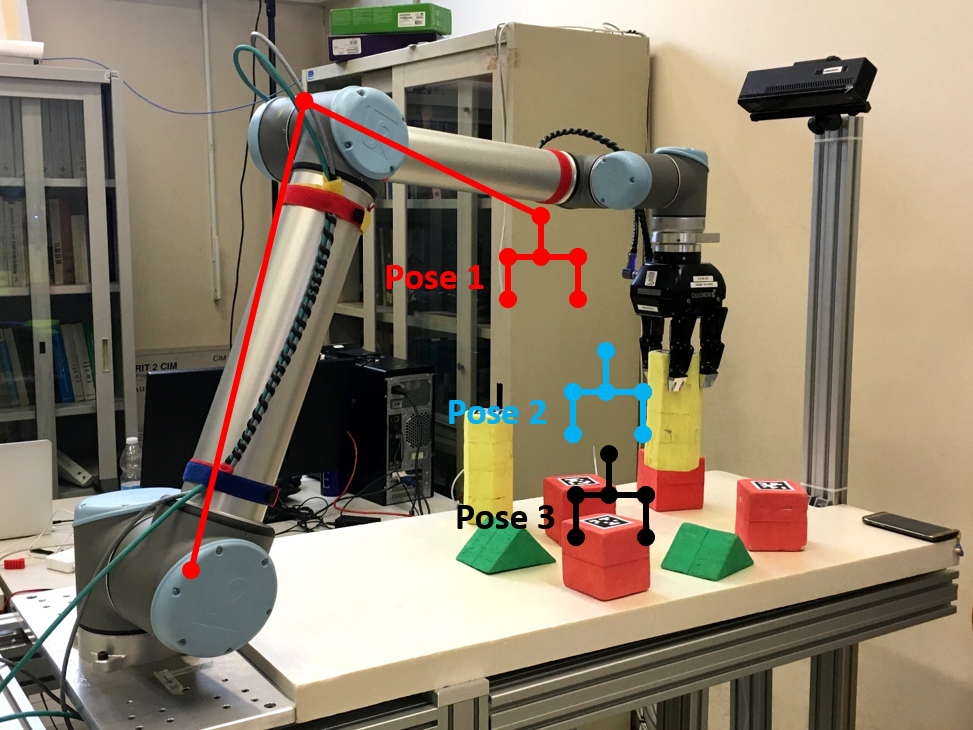

# Homework 2 - Manipulation

Suppose a human user has requested a set of x objects in order to accomplish an assembly task. These x objects have been detected – pose and category [shape and color] –  on a table, among other (n-x) objects. 

To solve this homework, you have to implement a MoveIt! routine letting the UR5 manipulator robot pick up every object of x and place it on a target area while avoiding the other objects placed on the table (collision objects).

Suggested routine:
1.	Assign the manipulator robot an initial configuration (see Figure 1 – pose 1);
2.	Define a collision object for every object on the table;
3.	Make the robot move on a target position (see Figure 1 – pose 2) that is Z cm above the object pose (align the end effector with the center of the object);
4.	Make the robot move (Z-z) cm above the marker (see Figure 1 – pose 3) through a linear movement. This pose must guarantee the correct grasp of the object;
5.	Remove the target object from the collision objects;
6.	Attach the object to the eef both through MoveIt! and through the Gazebo plugin (in simulation);
7.	Close the gripper;
8.	Come back to Z (see Figure 1 – pose 2);
9.	Move the manipulator to an intermediate pose;
10.	Move the manipulator to the final pose (inside an area you select at your choice – at the end of the lab experience, this area will be the area on the top of the mobile robot);
11.	Open the gripper;
12.	Detached the object via MoveIt! and the Gazebo plugin (in simulation);
13.	Restart from Point 1.

Figure 1 - Suggested manipulation routine
